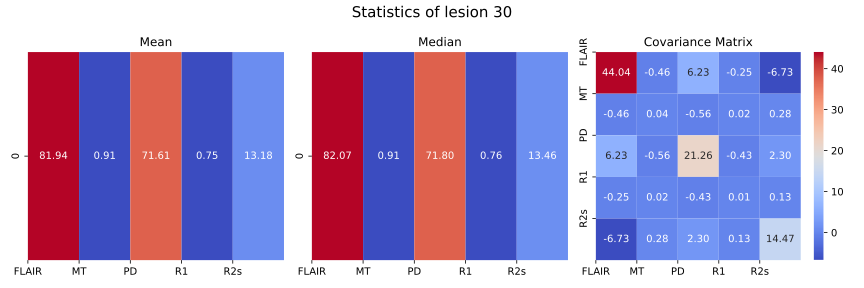
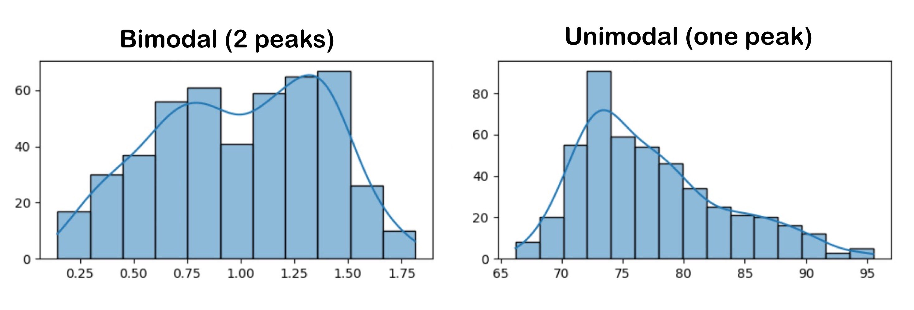
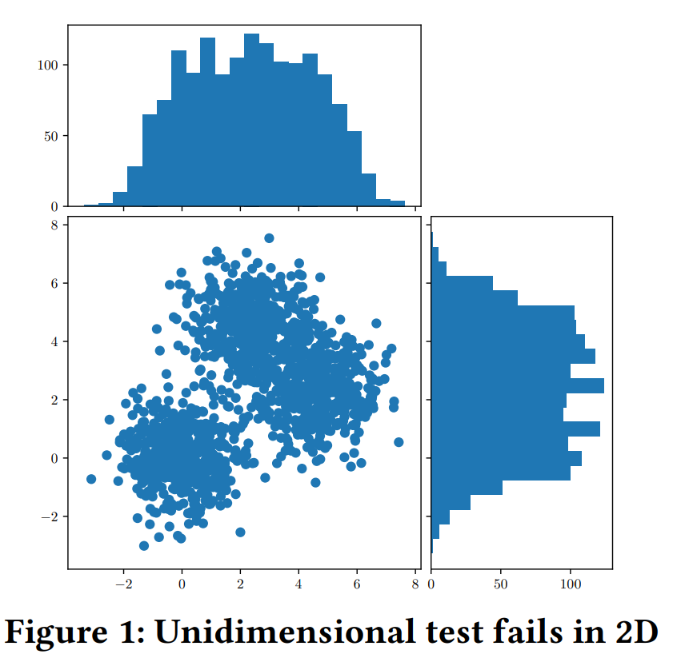
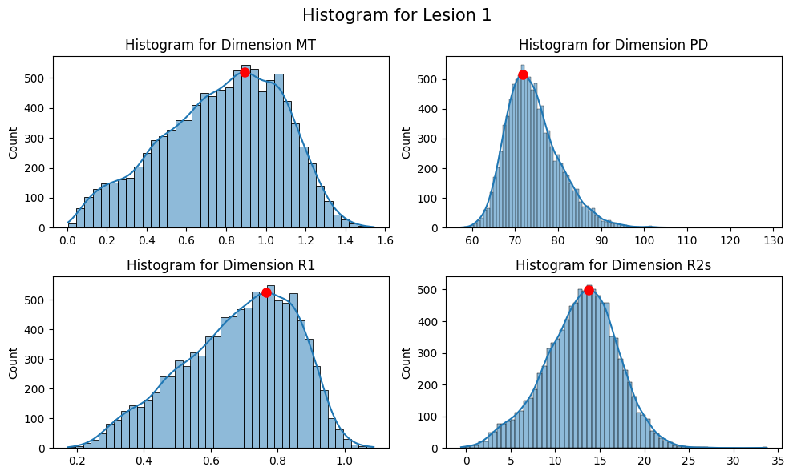
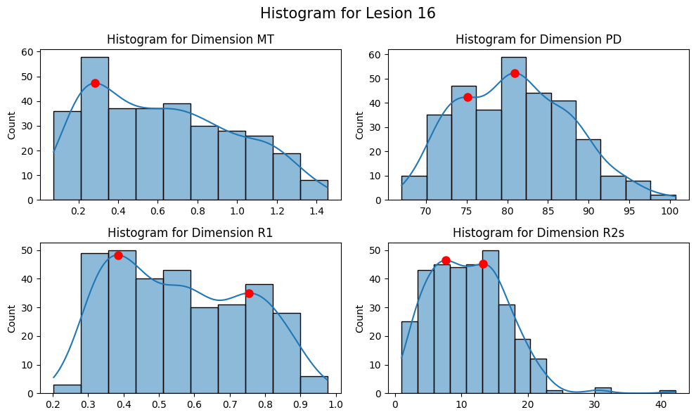
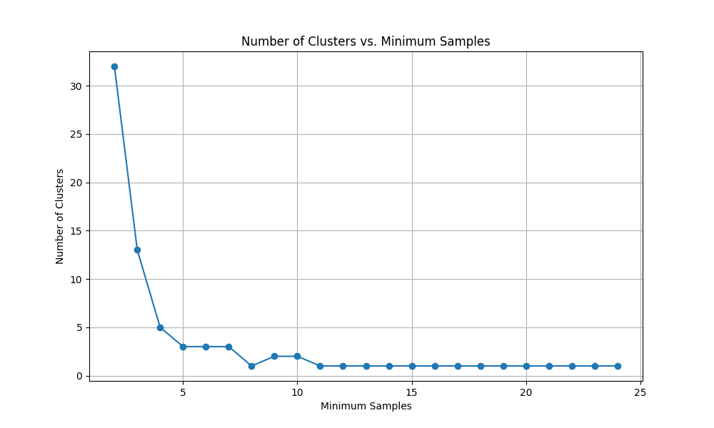
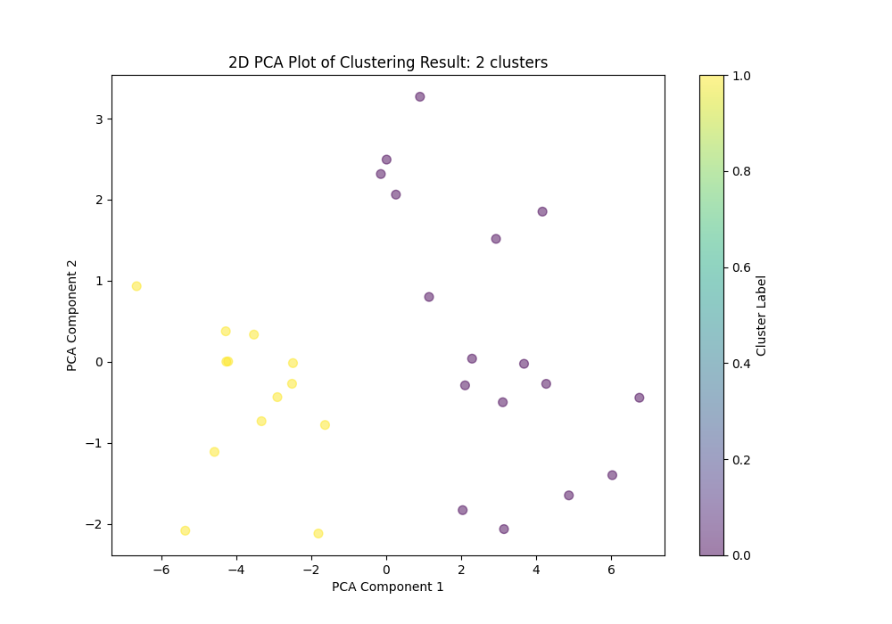
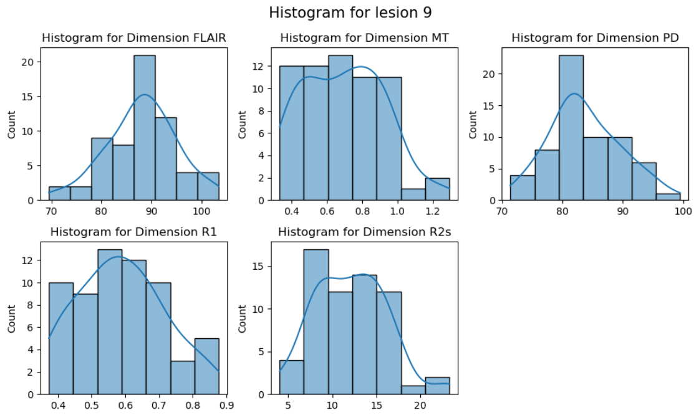
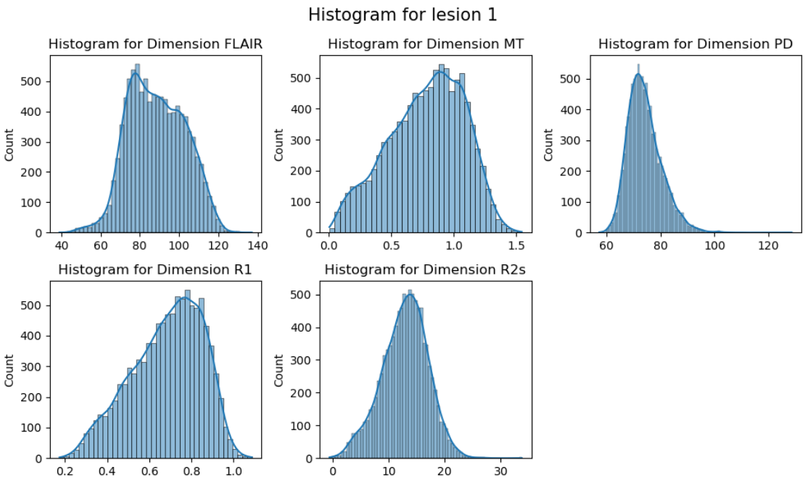

# Part 2 : Tissue Features.

For this second part of the project, the goal is to characterize the homogeneity of the tissues within each lesion for the 5 given patients. For this purpose, 4 quantitative MR images (MT, PD, R1, R2s), and a FLAIR MR image are used.

The following features must be characterized for each lesion:

- For each lesion in each patient:
    - Mean intensity for each image (FLAIR, MT, PD, R1, R2s)
    - Median intensity for each image (FLAIR, MT, PD, R1, R2s)
    - Variance of intensity for each image (FLAIR, MT, PD, R1, R2s)
    - Unimodal distribution test (using peaks and clustering)
    - Number of modes (using peaks and clustering)
    - Modes for each image (MT, PD, R1, R2s) using peaks
    - Modes for each image (MT, PD, R1, R2s) using clustering
    - Modes separation (using clustering). This is the distance between the centroids of each pair of clusters i.e. the distance between the modes.

## Mapping
### Principles

Now that the different lesions have been segmented, it is interesting to extract different lesion properties from other brain images. However, the different images do not necessarily have the same dimensions. It is therefore mandatory to have a mapping between images so that we can identify the positions of the lesions in the other images.

To do this, affine matrices of the different images are used. An affine matrix maps from voxels to some world coordinate system. If $M_A$ is the affine matrix of image A and $M_B$ the affine matrix of image B, and $V_A$ and $V_B$ are the voxels of image A and B, we can map from the coordinate system of image A to the coordinate system of map B using:

```math
V_\text{B, voxel size} = M_B^{-1} . M_A . R . V_\text{A, voxel size}
```

Where R is a 3D rigid body transform, defined by three translations in the x, y, and z directions, as well as three rotations around the x, y, and z axes. This matrix is used for the realignment of the different images. When the two different images are already aligned, which is the case for the images used, R is the identity matrix.

### Interpolation

The mapping allows converting the voxel indices from one image to the other. However, in some cases, the voxel indices returned by the mapping are non-integer values, and so it is not possible to directly access the data in the new image. To address this, interpolation can be used.

Interpolation is a type of estimation based on the range of a discrete set of known data points. There exist many types of interpolation. The one that will be used is trilinear interpolation, which consists of a weighted average of the neighboring voxels. For more details, please refer to this page: [Trilinear interpolation](https://en.wikipedia.org/wiki/Trilinear_interpolation).

Interpolation is therefore used to obtain data values at the desired voxel position. However, it is important to keep in mind that the values obtained are not exactly the true values but mathematical approximations.

### Process

The process to obtain the signal for each lesion is as follows: First, the lesions are segmented on a map. For more information on how the lesions are segmented, please refer to [part 1](Volumetric_features_methods.md). Once this is done, each lesion is separated, resulting in all lesions being listed. For each lesion, an array of measures for each voxel within the lesion is created. The different measures of the signal from the other images are obtained by first using the mapping to find the corresponding voxel in the other images, and then interpolation is used to obtain the signal measurement.

### Data type

For each lesion, we obtain an array of measures rather than a map of the voxels with corresponding signal measurements. This means that the spatial structure is lost after the signal measurements have been extracted. An improvement of the pipeline could be to use this spatial information in the tissues homogeneity analysis.

## Signal analysis
After extracting the values of FLAIR and quantitative MRI images (`MT`,`PD`,`R1`,`R2s`) for each lesion, we obtain a 5D matrix associated with each lesion. This matrix allows us to initiate the signal analysis to derive various tissue features, including tissue heterogeneity.
### Extraction of data from the signals 
For each lesion, we can extract several types of data.

First, we can compute the following features from signal for each image and for each lesion:
- mean, 
- median, 
- variance. 
- covariance.

The variance provides a measure of the spread of values within the lesion signal. A lesion with low variance indicates that the values are relatively close to each other and to the mean, suggesting that the tissue within the lesion may be relatively homogeneous. Conversely, a lesion with high variance indicates that the values are more spread out from the mean, suggesting tissue heterogeneity within the lesion. However, it's important to note that variance alone is not sufficient to conclude on tissue homogeneity or heterogeneity, as there may be variations not captured by variance alone. Therefore, we will also utilize other tools such as histograms to further assess tissue homogeneity/heterogeneity.

The covariance provides a measure of the degree to which 2 variables change together. A positive covariance indicates that when one variable increases, the other variable tends to increase as well. Conversely, when one variable decreases, the other variable tends to decrease. A negative covariance indicates that when one variable increases, the other variable tends to decrease, and vice versa. A covariance of zero indicates that there is no linear relationship between the two variables. 



We can then plot histograms relative to the 5 types of data that we have collected. From these histograms, we can extract their properties (number of modes, mixture, ...) and we can determine the distribution of the histograms : unimodal or bimodal.
- The distribution is *unimodal* when it has a single peak or mode. The distribution describes a dataset where the values tend to cluster around a single central value. In the MRI context, it would mean that the all the different parts of the tissue within the lesion have similar properties and behave in a similar way. 
- The distribution is *bimodal* when it has 2 distinct peaks or mode. This means that the dataset has two separate clusters of values, with each cluster having its own peak.

Examples of unimodal and bimodal distribution are shown below. Note that there are also multimodal distributions, which exhibit multiple peaks or modes. However, we will not cover this type of distribution in the project. The distributions will be either unimodal or bimodal. 



### Homogeneity vs heterogeneity
What is the goal of determining the type of distribution observed in the histograms?

We aim to study the tissue characteristics of lesions. The tissue within each lesion can be either homogeneous or heterogeneous. A homogeneous lesion indicates that the tissue properties are relatively consistent throughout. Consequently, the intensity of the MR images should be uniform and close to the mean intensity. As a result, the associated histograms for each MR image should display a unimodal distribution.

Conversely, a heterogeneous lesion exhibits varying tissue properties, leading to fluctuations in intensity values across different regions of the lesion. In this scenario, the intensity values are dispersed over a wider range, resulting in a distribution with greater variability and potentially multiple peaks. Therefore, the histograms may display a bimodal distribution, where two distinct peaks represent different types of tissue or tissue regions within the same lesion. In more complex cases, there may even be multiple peaks, resulting in a multimodal distribution.

In summary, analyzing the distribution of the histograms relative to quantitative tissue properties will provide us with information about the homogeneity or heterogeneity of the tissue within the lesion.

From a medical and clinical point of view, the heterogeneous or homogeneous nature of lesion tissues is an important component, as it provides clues to lesion mechanisms and physiologies [[2](#references), [3](#references)].
### Test for unimodality
To determine the homogeneity of the tissue within a lesion, we need to develop a test for unimodality, which confirms if the histogram distributions are unimodal. If not, the distributions are multimodal, indicating heterogeneous tissue.

Unimodality tests exist in the litterature (for example [tests for unimodality](https://en.wikipedia.org/wiki/Multimodal_distribution#Tests_for_unimodality)) but most are restricted to one dimensional data. However, here, we need to justify the uni(bi)modal distribution of intensities of each lesion based on multi-dimensional datasets (`MT`,`PD`,`R1`,`R2s`). 

A first approach involves using unidimensional unimodality tests on each dimension of the multidimensional data. So we apply the unimodality test independently to each dimension and we analyze each variable separately. However, this method fails to consider the relationships between variables in the dataset.  One example showing the limitation of the method is illustrated below (the example comes from [[1]](#References)). We can clearly see that the bidimensional data are bimodal on the bottom left side. However, when we consider the 2 dataset separately, the distributions appear unimodal. Consequently, unidimensional unimodality tests may erroneously conclude unimodality when the bidimensional dataset is actually bimodal. We are aware of the limitations imposed by this approach and that the results we may obtain could be erroneous. That is why we will also use another multidimensional method and compare the two.

{width=300px}

A second approach involves using a statistical unimodality test designed explicitly for multidimensional data, allowing for the analysis of data distribution across multiple dimensions simultaneously. By considering the interrelationships between variables, these tests offer a more comprehensive understanding of the distribution structure in multidimensional datasets. There is no consensus test for multivariate distributions. We decided to explore unsupervised learning methods, and more specifically a clustering method. 


We will use the 2 methods, i.e analyzing each variable separately with the unimodality test and analyzing the distribution of data in multiple dimensions simultaneously. Subsequently, we will compare the two methods and evaluate their respective limitations in terms of identifying the correct distribution. It is important to note that the two methods that have been developed do not make any direct assumptions about the type of mixture used.

### Threshold on the lesion volume 
We have decided to filter lesions based on their volume using a volume threshold. Indeed, we consider that performing unimodality tests on small lesions does not make much sense because they are so small that they can be directly regarded as unimodal. By looking at the litterature, [[5](#references)] suggests a minimum of 10 samples per dimension as empirical rule for conducting tests. As we are in 4 dimensions, we need minimum 40 observations, leading to a minimum volume of 40 vowels. So, we set the volume threshold to **40 voxels**. This means that if a lesion has a volume below 40 voxels, we classify it directly as unimodal and do not spend time studying its distribution using unimodality tests. Additionally, it is important to note that in practical applications, the minimal sample size required can vary depending on the desired power of the statistical test. This ensures that the tests performed are both reliable and robust.


#### Peak test
We can apply the first method described above, which involves conducting a unimodality test on each variable separately to assess the overall distribution and infer the homogeneity/heterogeneity of tissue within the lesion.

To implement this method, we follow these steps: for each dimension (corresponding to variables MT, PD, R1, and R2s) related to a lesion, we generate a histogram with a kernel density estimation (KDE) overlay. The KDE data is obtained from the plotted line, and peaks are identified for each dimension using the **find_peaks** function from `scipy.signal`, specifying parameters such as height and prominence to enhance sensitivity to peaks.

To draw conclusions about the overall distribution of the lesion, we simply compare the total number of peaks identified across all dimensions to the number of dimensions analyzed. If the total number of peaks exceeds the number of dimensions analyzed, we infer that the lesion exhibits a bimodal distribution. Conversely, if the total number of peaks is less than or equal to the number of dimensions analyzed, the distribution is considered unimodal. Our approach is to classify the overall tissue distribution as bimodal and heterogeneous if at least one dimension displays two distinct peaks, indicating a bimodal distribution.

Let's illustrate the method with examples from Patient 007.

The figure below shows histograms and kernel density estimations for the 4 variables. The *find_peaks* function is applied to each dimension, and the identified peaks are marked with red dots. We observe that each dimension has only one peak, indicating that the test will classify Lesion 1 as unimodal and therefore homogeneous. 



The second example below illustrates a case where the lesion exhibits a bimodal distribution. The test has identified two peaks present in three dimensions. Therefore, the test will classify Lesion 16 as bimodal and consequently heterogeneous.



As mentioned, some parameters specific to the findpeaks function had to be specified. Particularly, we use the parameter *prominence*, which measures how much a peak stands out from its surroundings. A peak with high prominence is one that is significantly higher than its immediate surroundings. By setting a prominence threshold, we can tune the sensitivity of the peak detection function. A low prominence threshold means that a small variation in the vicinity can lead to the detection of a peak. However, setting the threshold too low could lead to false positives, where the function detects multiple peaks and classifies the distribution as multimodal even though the detected peaks are not truly significant. On the other hand, setting the threshold too high could lead to false negatives because the function might not be sensitive enough to detect small variations in the distribution, potentially missing true peaks.
#### Automatic clustering method
The principle of an automatic clustering method is to group similar points together to delimit the set of subgroups present in the dataset. 

There are a number of different clustering methods, each with its own :
- defining the similarity between two points: the measure of similarity is very often based on a distance (e.g. Euclidean) between observations. It's because it's possible to define distance metrics in multidimensional spaces that clustering methods can be used in multivariate distributions.
- defining the way in which points are assigned to clusters: there are many different ways of doing this. We'll describe the precise method used in the remainder of this section.
- the ability to work with or without a predefined number of clusters: most clustering algorithms work with a predefined number of clusters, but there are others that can automatically find the right number of clusters. The latter exist because there are methods for estimating the optimal number of clusters. Using these tools, we can determine the number of modes present in a distribution.

In practice, to use a clustering method to determine whether a dataset is unimodal or multimodal, we can use the estimated optimal number of clusters: the number of clusters corresponds to the number of modes in the distribution.

We use the `OPTICS` algorithm [[4](#references)] implemented in the `sklearn` library to automatically cluster each lesion. We recover the number of modes and the set of clusters. The mode values can then be estimated from the points present in the clusters. We chose to use the cluster's center of mass as the mode value.

This method also provides a way to compute the bimodal separation. This is achieved by calculating the Euclidean norm between the centroids of two clusters. Since the method can return more than two clusters, a square matrix is computed, with its size determined by the number of clusters. The element *i,j* of this matrix corresponds to the bimodal separation between cluster *i* and cluster *j*.

In short, OPTICS bases clustering on the spatial density of points. The similarity between observations we use is the Euclidean distance. We set the algorithm's default parameters to a minimum of 10 points to define a neighborhood and an infinite maximum distance to limit a neighborhood.

##### Influence of the threshold parameters on the specificity and sensibility

This parameter can be varied by the user. The exact choice of threshold depends on the desired sensitivity-sensitivity trade-off. In practice, reducing the number of observations required to create a neighborhood greatly increases the probability of classifying a lesion as multimodal. The minimum value is 2 observations per cluster. This phenomenon can be illustrated by studying the number of clusters identified for lesion 30 as a function of the minimum number of neighbors required to define a cluster, as shown in the figure below.



The number of clusters tends to explode for small threshold values, which doesn't seem physiological if we imagine that a cluster represents a precise type of tissue.

More studies could be carried out to determine the value of the threshold according to needs.

##### Visualization of the clusters

As the data is in a 4-dimensional space, it's not possible to directly visualize the result of clusterization. In practice, however, we can try using a PCA analysis. Below we show the observations, labelled by their cluster number, in the space of the first two PCA components. There is a clear separation of clusters, with the first cluster on the left and the second on the right.



The clustering method identifies separations that are not aligned with the main axes of the variables (resulting in marginal distributions). As the criterion used to construct clusters is variance reduction, it can identify non-aligned directions of variation, such as the directions of the PCA.

In this case, we can recover the directionassociated with the first component of the PCA :

```math
\vec{d_{PCA,1}} = [-0.01241742 ~~~ 0.8494303 ~~~ -0.01116127  ~~~ 0.527437]^T
```

We can see that this is not perfectly aligned with a single axis of variables.

#### Comparison

The major difference between the two methods is the dimensionality of the approach. The peak test is based on the marginal distributions of the data, i.e., unimodality is tested on each dimension of the multidimensional data. In contrast, clustering applies directly to the complete distribution of data. If the amount of data is smaller than the threshold, both approaches will return the same result: unimodality. This means that for a small amount of data, the two methods will always be in tune.

The difference in the dimensionality of the approaches could lead to different results. To emphasize this, let us first compare the total number of unimodal distributions returned by the two methods for each patient.

| Patient number | Number of lesions | Number of unimodal distributions using peak test      | Number of unimodal distributions using automatic clustering       |
| ------ | ------------ | ------------------ | -------------------- |
| 007      | 35    | 30 | 30 |
| 018      | 41       | 37  | 38  |
| 027      | 49        | 40  | 43  |
| 032      | 41      | 32 | 29  |
| 034      | 37        | 32 | 33   |

From this table, we can see that the two methods return a slightly different number of unimodal distributions, which underlines the difference between the approaches used. By looking in more detail at the unimodality returned for each lesion of a patient, as demonstrated for patient '007' in the [notebook](demo/tissue_features.ipynb), it can be seen that sometimes the peak test returns unimodality while clustering indicates bimodality, or vice versa.

Let's examine a case where the peak test detects unimodality and clustering does not, and another case with the inverse situation. For this, patient '007' has been used.



In this first example, the clustering approach returns unimodality, while the peak test approach returns bimodality. There could be two different reasons for this. First, the peak test method might be too sensitive, detecting a bimodal distribution where there isn't one. Another reason could be that the clustering method is not sensitive enough. Indeed, if the marginal distributions are bimodal, such that they are detected by the peak test, then the joint distribution is also bimodal, and clustering should detect bimodality. This means that tuning the parameters of the methods is essential for achieving good results.



For the second example, bimodality is returned by clustering, while the peak test predicts unimodality. From the marginal distributions, bimodality seems more suitable. This is what is returned by clustering. One reason for this is that clustering can capture information present in the data that is not especially visible in the marginal distributions.

In conclusion, the clustering approach should be preferred as it captures multidimensional information, which is not the case with the peak test method. This means that if both methods are correctly tuned, clustering should always return a larger number of bimodal distributions and detect all the bimodal distributions identified by the peak test. However, in the automatic pipeline, we will still provide the results of both methods in the CSV file to allow the user to choose the desired method's results.

## a small proof of concept

To demonstrate the usefulness of the pipeline and how it can be used, we are providing a [notebook](demo/tissue_features.ipynb) that can be viewed directly online. This notebook also details how we generated the figures presented on this page. All the results generated from the pipeline for the given patients - whose mri images are available in [the data folder](demo/data) - are available in .csv files in [the results folder](demo/results).

# References 
[1] - Siffer, A., Fouque, P.-A., Termier, A., & Largouët, C. (2018). "Are your data gathered?" In Proceedings of the 24th ACM SIGKDD International Conference on Knowledge Discovery & Data Mining (KDD '18), August 19‒23, 2018, London, United Kingdom (pp. 2210–2218). ACM Press. doi:10.1145/3219819.3219994

[2] - Kim, M., & Jewells, V. (2020). Multimodal image analysis for assessing multiple sclerosis and future prospects powered by artificial intelligence. Seminars in Ultrasound, CT and MRI, 41(3), 309-318. https://doi.org/10.1053/j.sult.2020.02.005.

[3] - Caruana, G., Pessini, L.M., Cannella, R. et al. Texture analysis in susceptibility-weighted imaging may be useful to differentiate acute from chronic multiple sclerosis lesions. Eur Radiol 30, 6348–6356 (2020). https://doi.org/10.1007/s00330-020-06995-3

[4] - Ankerst, Mihael, Markus M. Breunig, Hans-Peter Kriegel, and Jörg Sander. “OPTICS: ordering points to identify the clustering structure.” ACM SIGMOD Record 28, no. 2 (1999): 49-60.

[5] - Johnson, R. A., & Wichern, D. W. (2007). Applied Multivariate Statistical Analysis. Pearson Prentice Hall.