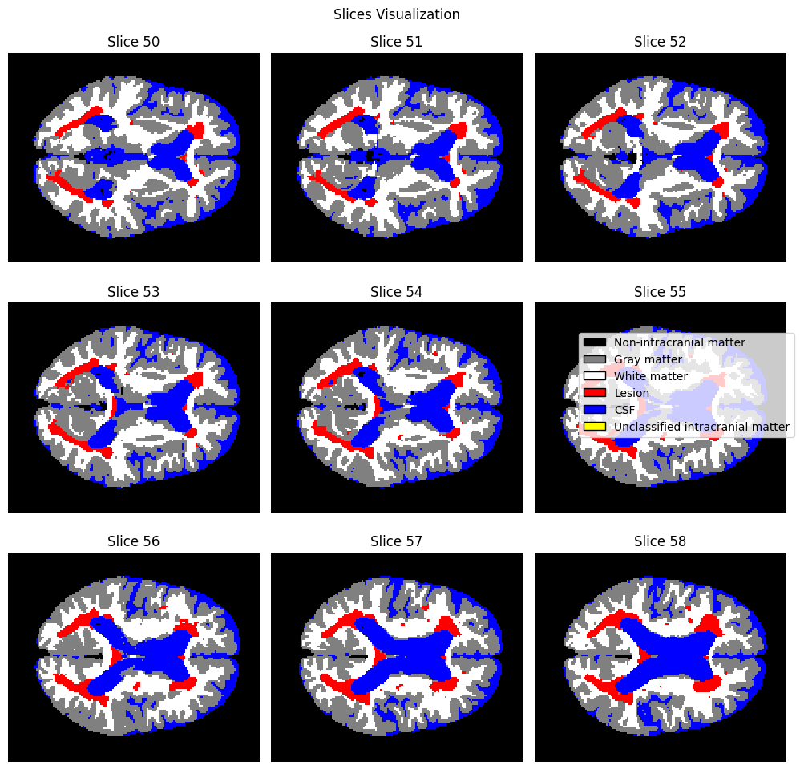
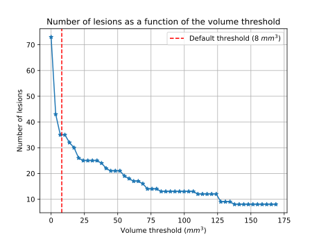
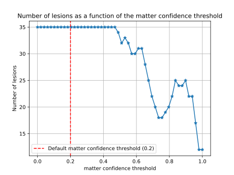
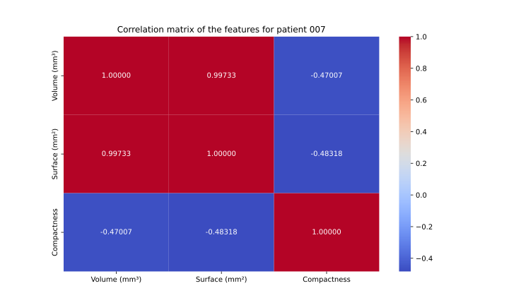
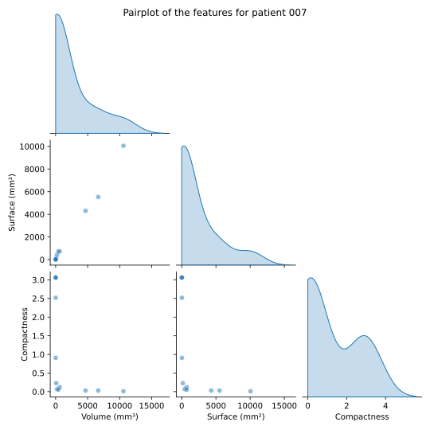

# Part 1 : Volumetric Features.
## Introduction
For this first part of the project, we must extract the volumetric features of the lesions for the 5 given patients.  One key aspect is to identify the lesions within the brain based on some probability maps `c1`, `c2`,`c3`,`c4` for respectively the grey matter, white matter, lesions and cerebro-spinal fluid. 

The following volumetric features relative to the lesions are computed :

- For each lesion in each patient : 
    - The volume
    - The surface
    - The compactness

- For each patient, a summary table is created, containing : 
    - The number of lesions
    - The intracranial volume
    - The total lesion load
    - The lesion volume (total, mean and standard deviation)
    - The lesion surface (total, mean and standard deviation)
    - The lesion compactness (mean and standard deviation)

This report explains the whole procedure to identify the lesions in an automated way. It also displays the resulting volumetric features and a small part of the report is dedicated on the use of the collected data to analyze the disease variability among patients (inter-variability) and within the patient (intra-variability). 
## Extraction of individual lesions

### Voxel classification
First, before determining the regions containing lesions in the brain, it seems important to differentiate voxels belonging to the intracranial matter from blank voxels (air). To do so, we notice that the sum of the probabilities of the maps `c1`, `c2`,`c3`,`c4` does not give 1, meaning that the remaining percentage is attributed to regions that potentially do not belong to the intracranial matter. So, we created an additional map `c5` containing the probabilities that a voxel is not part of the intracranial matter and computed as $$c5 = 1- (c1 + c2 + c3 + c4) $$

With the 5 probability maps, we made a classification of the voxels using 2 thresholds. 
- The first threshold is the "intracranial confidence threshold" and is used to determine which voxels are not classified as intracranial matter and which are. A voxel is assumed to belong to the intracranial volume if the sum of its respective probabilities for being grey matter, white matter, lesion and CSF is higher than the threshold, i.e 

$$
c1 + c2 + c3 + c4 > \text{intracranial\_confidence\_threshold}
$$
If the criterion is not satisfied, then the voxel is classified as being 'blank space' i.e. non-intracranial matter. We chose to set the default threshold at 0.5 arbitrarily.

- The second threshold is the "matter confidence threshold" and is applied to determine the nature of intracranial voxels within the brain. To achieve this, we compare the highest probability value of a voxel, representing grey matter, white matter, lesion, or cerebrospinal fluid (CSF), with the threshold. If the probability value surpasses the threshold, the voxel is classified according to the nature associated with the highest probability value, as it is deemed statistically significant. Conversely, if all probability values fall below the threshold, the voxel remains unclassified and stays therefore unknown. This classification process can be expressed mathematically as follows:
$$
argmax([c1,c2,c3,c4] > \text{matter\_confidence\_threshold})
$$
This is how we can determine the voxel belonging to a lesion. A voxel is considered as a lesion :
1. If it is classified as an intracranial matter i.e. if 
$$
c5 < 1 - \text{intracranial\_confidence\_threshold}
$$ 
2. **AND** if its corresponding probability value `c3` is higher than the other probabilities **AND** higher than the matter_confidence_threshold. The second threshold is set at 0.2 by default, where 0.2 represents the probability obtained if the four elements within the brain were equally distributed. But, a sensitivity analysis to the matter threshold is conducted below, to see if the impact of the threshold on the number of lesions detected. 

The voxel classification enables us to delineate the various components of the brain and identify regions of lesion. The figure below illustrates the distribution of these components within the brain of Patient 7, spanning from slice 50 to slice 58. Lesions are depicted in red. We observe that the depicted brain closely resembles a physiological brain, with grey matter lining the external part and white matter situated within. Additionally, the ventricles' shape, filled with cerebrospinal fluid (CSF), is recognizable. However, we identify black regions within the brain, which is physiologically implausible, as the brain does not contain empty spaces. This discrepancy can be attributed to certain voxels failing to surpass the initial threshold required to classify them as intracranial matter.


### Computation of the intracranial volume
To standardize the computation of the total lesion load, it is necessary to determine the total intracranial volume of the patient. This is accomplished by utilizing the map containing classified voxels, where blank voxels are represented by the value 0. By counting the number of blank voxels and subtracting this count from the total number of voxels, we obtain the intracranial volume in terms of voxels.

### Segmentation of the lesions

Once the voxels have been classified, the lesion probability map can be binarized, i.e a voxel has a value of 1 if it belongs to a lesion and 0 otherwise. Once it has been done, the lesions can be segmented. To this end, the function *label* from **scipy.ndimage** has been used.

#### Connectivity

To use the function *label*, a connectivity must be defined, which is the way in which two voxels are considered as connected. The default connectivity used by the function is the 6 neighbours connectivity, meaning that two voxels are connected if they have a common face. We made the choice to keep this connectivity for the segmentation. A way of modifying the connectivity used has been implemented in our code. For more details, please refer to the function *get_segmentation_and_properties* in the [documentation file](Documentation.md).

### Filtering 

Once individual lesions have been segmented, our pipeline applies a filter based on the volume of each lesion. If the volume is below a critical minimum volume - a parameter that the user can specify - the lesion is excluded from the list of lesions.

#### Lesion Volume Filter

By default, the minimum volume threshold is set to 8 $mm^3$, a value informed by two seminal studies [[1, 2]](#references).

[[1]](#references) suggests a minimum diameter of 3mm, equating to a volume of approximately 14 $mm^3$ for spherical lesions. This inference is drawn from the study's findings, which demonstrate a consistent rise in odds ratios with escalating volumes of the lesions. Moreover, the discriminative capability peaked at a size threshold around a 3mm diameter.

[[2]](#references) suggests a minimum length of 3mm in its longest direction, which can be translated as a cube with a diagonal of 3mm in the case of less compact lesions, thus a side length of approximately 1.73mm, yielding a volume of approximately 5.2 $mm^3$.

The chosen threshold of 8 $mm^3$ represents a compromise between these two values. It's important to note that the discrete nature of MRI images introduces biases in the volume computation, particularly at a scale so close to that of a voxel.

### Impact on Method Sensitivity and Specificity

#### Influence of the volume threshold
The choice of the minimum volume parameter significantly influences the sensitivity and specificity of our method. Lowering the minimum volume threshold may increase sensitivity by detecting smaller lesions, including those with potential clinical significance. However, this might also lead to an increase in false positives, reducing specificity. Conversely, raising the minimum volume threshold may improve specificity by filtering out smaller, potentially insignificant lesions, but at the cost of decreased sensitivity, potentially missing clinically relevant lesions. Therefore, careful consideration of this parameter is crucial to balance sensitivity and specificity for optimal lesion detection in clinical practice.

The figure below shows the influence of the parameter on the number of lesions in the specific case of patient 007. As expected, the trend observed is a decrease in the number of 'significant' lesions, i.e. those that pass the filter, for an increase in the minimum volume required. We can also see that the default value (in red on the figure) roughly divides the curve into a highly threshold-sensitive part (large variation) and a less threshold-sensitive part. This observation suggests a very large number of very small lesions and a smaller number of relatively larger lesions.



#### Influence of the matter confidence threshold 
We have established a matter threshold for voxel classification, ensuring confidence in determining the voxel's nature when surpassing this threshold. Its value was set at 20%, but it's worth noting that the choice of threshold also impacts sensitivity and specificity.

To investigate the threshold's impact, the graph below depicts the number of detected lesions plotted against the matter confidence threshold for Patient 7. Similar to the volume threshold, increasing the matter confidence threshold may decrease sensitivity due to potential missed lesions resulting from the high threshold, yet it may enhance specificity by reducing potential false positives. Conversely, lowering the threshold enhances sensitivity but at the expense of reduced specificity.



We can observe that for a threshold value above approximately 0.75, the number of detected lesions increases, while the trend indicates a decrease in the number of lesions with increasing threshold. This sudden increase may be explained by the fact that increasing the threshold causes some lesions to be split into smaller lesions due to changes in connectivity.

## Volumetric features

Once the different lesions have been segmented, it is necessary to compute some characteristics associated to the lesions to characterize them.

* Volume: The volume of the lesions is computed using the volume attribute of *regionprops_3D* from **porespy.metrics**, which counts the number of voxels of the lesions. The value returned by this function is in voxel size and so need to be modified to get a value in $mm^3$. To do this, the affine matrix of the voxel is required, mapping from voxels to $mm^3$. To get the volume of a voxel, the determinant of the affine matrix has to be computed. Once it has been done, the volume of the lesions in voxel size is multiplied by the volume of the voxel to obtain the volume of the lesions in $mm^3$.

* Surface area: The surface area of the lesions is computed using the surface area attribute of *regionprops_3D* from **porespy.metrics**. This function creates a 2D surface mesh of the 3D volume before computing the surface area. As for the volume, the result is given in voxel size and needs to be converted into $mm^2$ using the affine matrix of the voxel. The norm of the first three columns of the affine matrix gives the voxel size in the 3 directions of space. Moreover, to get the surface of only one face, the total surface area is divided by 6. If we denote x the norm of the first column, y the norm of the second column and z the norm of the third column, the surface of one face of a voxel is given by

```math
\text{Area of one face of the voxel} = \dfrac{(2 x y + 2 y z + 2 x z)}{6}
```

It is importance to notice that this expression is exact only for cubic voxels. Otherwise, it would be an approximation as not all the faces would have the same area.

* Compactness: the compactness is a dimensionless measure that indicates the degree to which a shape is compact. The definition of the compactness used in the code comes from [[3]](#references) and is defined as 

```math
C = \dfrac{36 \pi \text{Volume}^2}{\text{Area}^3}
```
The more compact the shape, the higher the compactness value. This measure is useful for characterizing the extent of the lesions

* Total lesion load: The total lesion load is the total volume of the lesions and can be particularly useful to track the progression of the disease. However, to be able to compare this measurement between different patients, it is necessary to normalize this measure with respect to a reference volume. The reference volume chosen is the intra-cranial volume of the patient. The total lesion load is the total volume of the lesions divided by the intra-cranial volume and multiplied by 100 to get an expression in percent.

```math
\text{Total lesion load} = \dfrac{\text{Total volume of the lesions}}{\text{Intracranial Volume}} . 100
```

## Effect of the discretisation on the volumetric features

As a 3D image is an assembly of voxels, the representation of the lesions in the image is not continuous but discrete. The voxel representation of the lesions leads to a misestimation of their volume and surface area. The lesions are approximated by a set of cubic voxels which are used to calculate an estimate of the surface area and volume of the actual lesions. This means that the discretisation induces a bias in the volumetric features measurements and so caution must be taken when interpreting the data obtained. The smaller the size of the voxels with respect to the lesions size, the better the accuracy of the surface and volume measurements. 

One thing to notice is that the compactness is also affected by the discretisation. First, the volume and surface area are misestimated due to the voxel representation of the lesions, as explained above, leading to a misestimation of the compactness measurement.<!--POURQUOI ? C'est quoi la misestimation--> Moreover, the surface area, computed using the surface area attribute of *regionprops_3D* from **porespy.metrics**, creates a 2D surface mesh. The mesh created using the Marching cube algorithm is made up of triangular faces, whereas the lesions are made up of a set of cubic voxels. This can lead to an underestimate or overestimate of the surface area of the lesion. This is why, if the surface area is underestimated, compactness can have a value greater than 1, whereas in reality compactness can only take values between 0 and 1.

## A small proof of concept: Exploring Disease Variability 

To demonstrate the usefulness of the pipeline and how it can be used, we are providing a [notebook](demo/volumetric_features.ipynb) that can be viewed directly online. This notebook also details how we generated the figures presented on this page. All the results generated from the pipeline for the given patients - whose mri images are available in [the data folder](demo/data) - are available in .csv files in [the results folder](demo/results). A summary file is also available.

Once the volumetric features have been extracted, we can make 2 types of analysis : variability between patients and variability within patient. 

### Inter-patient variability
The table below presents the overall volumetric features for each patient. This allows for comparisons between patients.
| Patient | Intracranial Volume (mm³) | Number of lesions | Total lesion load [%] | Total lesion volume (mm³) | Average lesion volume (mm³) | Std lesion volume (mm³) | Total lesion surface (mm²) | Average lesion surface (mm²) | Std lesion surface (mm²) | Average lesion compactness | Std lesion compactness |
| ------- | ------------------ | ----------------- | --------------------- | ------------------------- | --------------------------- | ----------------------- | -------------------------- | ---------------------------- | ------------------------ | -------------------------- | ---------------------- |
| 007     | 1798814.25         | 35                | 3.951                 | 71077.5                   | 2030.786                    | 7633.410                | 41721.196                  | 1192.034                      | 3913.321                 | 0.606                     | 1.260                 |
| 018     | 1777467.37         | 41                | 4.607                 | 81901.125                 | 1997.588                    | 8384.489                | 46873.381                  | 1143.253                      | 4416.483                 | 0.680                     | 1.133                 |
| 027     | 1784268.0          | 49                | 1.977                 | 35282.25                  | 720.046                     | 2065.461                | 30327.477                  | 618.928                      | 1542.916                  | 1.533                    | 2.893                 |
| 032     | 1785132.0          | 41                | 0.721                 | 12868.875                 | 313.875                     | 587.842                 | 13321.349                   | 324.911                      | 466.006                  | 1.278                    | 3.424                 |
| 034     | 1782600.75         | 37                | 0.709                 | 12646.125                 | 341.787                     | 847.259                 | 14874.984                   | 402.026                      | 942.507                  | 0.807                     | 1.448                 |

First, we observe varying numbers of detected lesions for each patient, with Patient 7 having the fewest and Patient 29 having the most. However, this is not necessarily indicative of the severity of the patient's disease. Indeed, upon examining the total lesion volume, we can clearly see that Patient 7, despite having the fewest lesions, has a higher total lesion volume than other patients such as Patients 27, 32, and 34, who have a higher number of lesions, resulting in a higher total lesion load. In fact, there are fewer lesions within the brain of Patient 7, but they are larger, with an average volume of 2030 mm³. This volume is significantly greater than the average volume of lesions in Patients 29, 32, and 34, despite these patients having more lesions. So, these patients have more lesions, but they are of smaller size. Patient 18 has the highest total lesion load, indicating the most advanced stage of the disease. A similar type of analysis can be conducted using data related to the surface area of the lesion instead of its volume. 

Regarding compactness, Patients 27 and 32 exhibit a higher average lesion compactness compared to Patients 7 and 18. This indicates that their lesions have a more compact shape, whereas the lesions of Patients 7 and 18 are more dispersed within the brain.

### Analysis of patient 007

The summary file already tells us that patient 007 shows some variability in the volumetric features of his/her lesions. Here, we briefly explore this variability.


| Patient | Intracranial Volume (mm³) | Number of lesions | Total lesion load [%] | Total lesion volume (mm³) | Average lesion volume (mm³) | Std lesion volume (mm³) | Total lesion surface (mm²) | Average lesion surface (mm²) | Std lesion surface (mm²) | Average lesion compactness | Std lesion compactness |
| ------- | ------------------ | ----------------- | --------------------- | ------------------------- | --------------------------- | ----------------------- | -------------------------- | ---------------------------- | ------------------------ | -------------------------- | ---------------------- |
| 007     | 1798814.25         | 35                | 3.951                 | 71077.5                   | 2030.786                    | 7633.410                | 41721.196                  | 1192.034                      | 3913.321                 | 0.606                     | 1.260                 |


In fact, if we look at the first lines of the file specific (table below) to patient 007, we can see that some lesions are much larger than others. There is also heterogeneity in lesion compactness.

| Lesion | Volume (mm³) | Surface (mm²)      | Compactness          |
| ------ | ------------ | ------------------ | -------------------- |
| 1      | 33442.875    | 16976.032 | 0.0259 |
| 2      | 23.625       | 65.946  | 0.2201  |
| 3      | 310.5        | 553.332  | 0.0644  |
| 4      | 124.875      | 194.211 | 0.2408  |
| 5      | 20.25        | 38.971 | 0.7836   |

Firstly, we look at the relationship between surface area, volume and compactness in this patient. The figure below shows the linear correlation coefficients. 



Surface area and volume are very strongly - almost perfectly - correlated: an increase in lesion volume seems to be coupled with an increase in surface area. Another very interesting result is the negative correlation between volume (surface area) and compactness. This correlation is not perfect, indicating that the relationship is not perfectly linear and systematic. An increase in volume is accompanied by a decrease in compactness. This result is not surprising in a discrete world, where it is easier to deviate from a perfect sphere when the characteristic scale of the lesion is larger than that of a voxel. But this result is not just the result of discretization, as we apply a minimal volume that eliminates lesions composed of just a few voxels. Thus, larger lesions tend to be more deformed than smaller ones in patient 007. 

Finally, we can draw up a figure that allows us to explore the patient's specific characteristics more quickly. The pairplot below directly highlights the strong correlation between volume and surface area. We can also see that the distribution of compactness is more complex.



These analyses, although very brief and without any major research questions, highlight the value of our automation tool in research and in the medical field.

# References

[1] - Grahl, S. et al. (2019). "Evidence for a white matter lesion size threshold to support the diagnosis of relapsing remitting multiple sclerosis." *Multiple Sclerosis and Related Disorders*, Volume 29, 124-129. DOI: [10.1016/j.msard.2019.01.042](https://doi.org/10.1016/j.msard.2019.01.042)

[2] - Filippi, M., Preziosa, P., et al. (2019). "Assessment of lesions on magnetic resonance imaging in multiple sclerosis: practical guidelines". *Brain*, 142(7), 1858–1875. DOI : [10.1093/brain/awz144](https://doi.org/10.1093/brain/awz144)

[3] - Žunić, J., Hirota, K., & Martinez-Ortiz, C. (2012). "Compactness measure for 3D shapes", Dhaka, Bangladesh, 18-19 May 2012. DOI: [10.1109/ICIEV.2012.6317466](https://doi.org/10.1109/ICIEV.2012.6317466)
